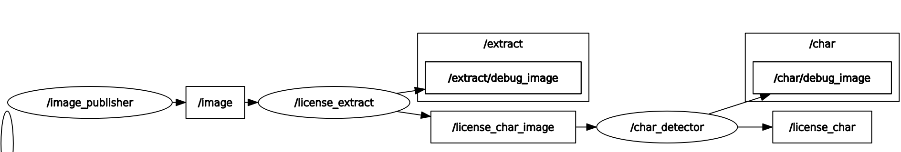
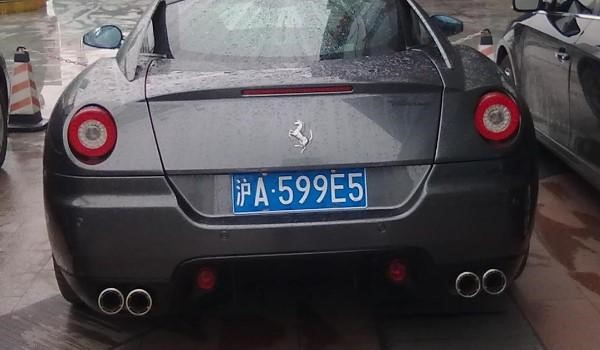
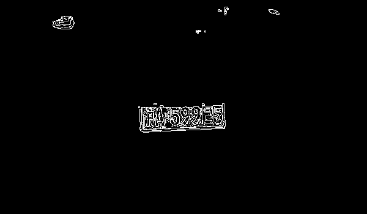
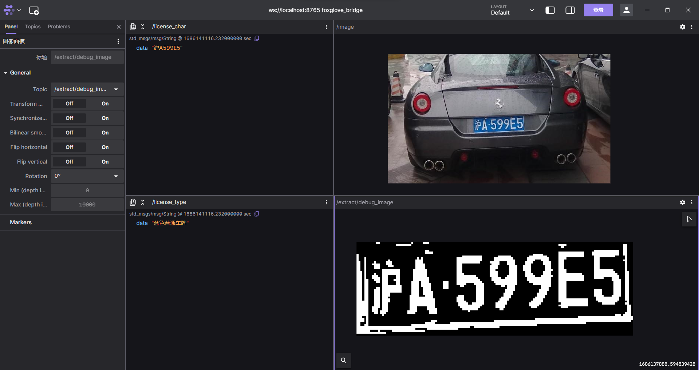
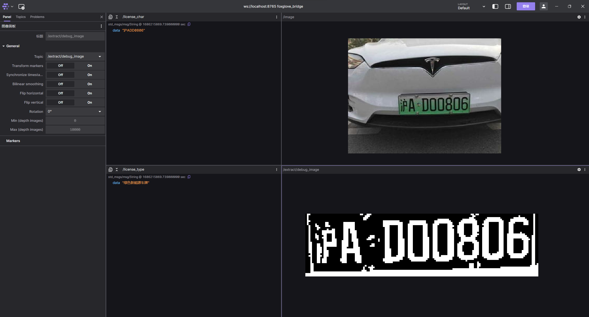
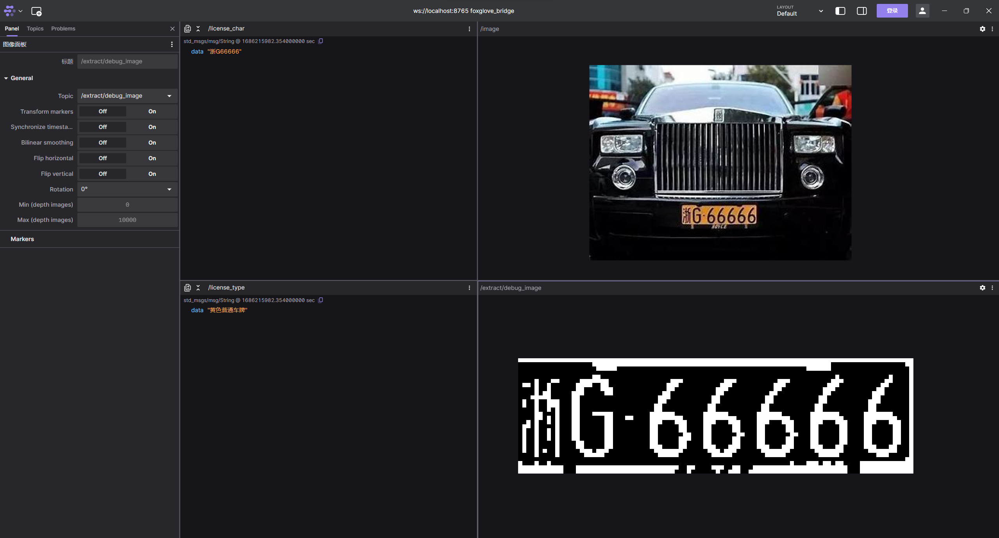
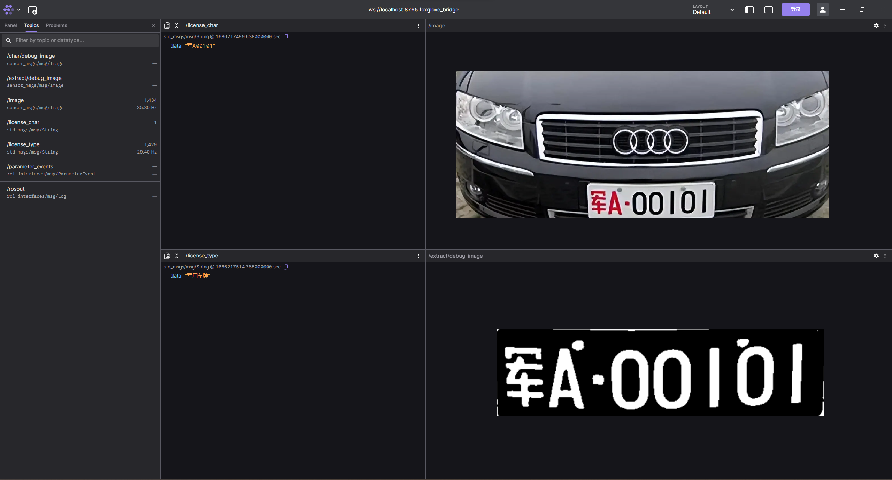

# 车牌识别

## 目录

[toc]

## 概述

本作品是一个车牌识别系统，基于ROS2 Galactic环境，使用C++编写，集成封装车牌检测、车牌识别、车牌字符分割、车牌字符识别等功能。
作品开源链接 [FaterYU/License_Plate_Number_Detect (github.com)](https://github.com/FaterYU/License_Plate_Number_Detect)
>本作品仅在Ubuntu 20.04 + ROS2 Galactic环境下持续集成测试通过。

### 依赖软件环境

- [Ubuntu 20.04](https://ubuntu.com/download/desktop)
- [ROS2 Galactic](https://docs.ros.org/en/galactic/Installation/Ubuntu-Install-Debians.html)
- [OpenCV 4.5.2](https://docs.opencv.org/4.5.2/d7/d9f/tutorial_linux_install.html)

### 测试硬件环境

- Intel NUC 11
- Hikvision MV-CA016-10UM

### 可视化工具

- [Foxglove Studio](https://foxglove.dev/docs/studio/installation)

### 开发工具及环境

- [VSCode](https://code.visualstudio.com/)
- [WSL2 Ubuntu 20.04](https://docs.microsoft.com/en-us/windows/wsl/install-win10)

## 整体设计

### rqt_graph



### Package

- [license_detector_bringup](/license_detector_bringup)
    启动文件
- [image_publisher](/image_publisher)
    静态图像发布节点
- [license_detector_interfaces](/license_detector_interfaces)
    定义识别节点的接口及用于Debug的消息
- [license_extract](/license_extract)
    车牌检测并分割字符节点，订阅静态图像，发布二值化处理后的车牌字符图像
- [char_detector](/char_detector)
    车牌字符识别节点，订阅二值化处理后的车牌字符图像，发布识别结果

### 主要节点工作流程

#### image_publisher

1. 读取车辆图片静态文件
2. 发布车辆图片

#### license_extract

1. 初始化多个车牌检测器
2. 订阅车辆图片
3. 使用多个车牌检测器检测车牌并分割字符
4. 发布车牌分割后的字符图像

#### char_detector

1. 初始化车牌字符识别器
2. 订阅车牌分割后的字符图像
3. 使用车牌字符识别器识别车牌字符
4. 发布车牌字符识别结果

## 具体实现

### 核心检测分割算法

#### 车牌位置检测

本作品主要通过颜色定位车牌位置。以蓝色普通车牌为例，其车牌底色为蓝色，使用HSV颜色空间，蓝色的H值范围为[100, 124]，S值范围为[43, 255]，V值范围为[46, 255]。车牌字符颜色为白色，使用HLS颜色空间，白色的H值范围为[0, 255]，L值范围为[0, 50]，S值范围为[0, 255]。因此，可以通过颜色定位车牌位置。结合经过颜色空间处理后的车牌底色和车牌字符颜色图像，经过简单的运算后可以得到主要包含车牌的二值化图像。下一步通过轮廓检测，找到包含车牌的轮廓，进而定位车牌ROI。

#### 车牌字符分割

从车牌的ROI图像中，再次进行适用于分割车牌字符的二值化处理，得到车牌的二值化图像。通过轮廓检测，找到包含车牌字符的轮廓，对其按轮廓的最小外接矩形进行分割，进而定位数个车牌字符ROI。

#### 车牌字符识别

车牌字符识别采用车牌规范标准字符与提取的字符ROI进行匹配的方式，匹配度最高的字符即为识别结果。匹配方式为计算两者的汉明距离，汉明距离越小，匹配度越高。

### 面向对象设计

#### 车牌检测器

对车牌检测器进行封装，设计调参接口如下。车牌检测器接收原始图像，经过一系列检测分割后，返回二值化图像数组，数组中的每个元素为一个二值化图像，每个二值化图像包含一个车牌字符。同时实例化多个车牌检测器，每个车牌检测器使用不同的车牌颜色空间，以达到识别不同颜色车牌的目的。

| 参数            | 类型        | 说明                |
| --------------- | ----------- | ------------------- |
| text_low        | cv::Scalar  | 车牌字符颜色HLS下限 |
| text_high       | cv::Scalar  | 车牌字符颜色HLS上限 |
| background_low  | cv::Scalar  | 车牌底色HSV下限     |
| background_high | cv::Scalar  | 车牌底色HSV上限     |
| text_color      | std::string | 车牌字符颜色        |

#### 车牌字符识别器

对车牌字符识别器进行封装。仅需实例化一个车牌字符识别器。车牌字符识别器接收二值化图像数组，数组中的每个元素为一个二值化图像，每个二值化图像包含一个车牌字符。经过一系列处理后，返回识别结果。

### 核心程序

#### 图像二值化

对图像分别进行HLS和HSV颜色空间处理，经过简单运算后，得到包含车牌的二值化图像。

```c++
cv::Mat hls_image;
cv::Mat hsv_image;
origin_image_ = image.clone();
cv::cvtColor(image, hls_image, cv::COLOR_BGR2HLS);
cv::cvtColor(image, hsv_image, cv::COLOR_BGR2HSV);
cv::inRange(hls_image, text_low_, text_high_, text_mask_);
cv::inRange(hsv_image, background_low_, background_high_, background_mask_);

cv::Mat add_mask;
cv::Mat sub_mask;
cv::add(text_mask_, background_mask_, add_mask);
cv::subtract(text_mask_, background_mask_, sub_mask);
cv::subtract(add_mask, sub_mask, aim_mask_);

cv::bitwise_and(image, image, aim_image_, aim_mask_);
cv::cvtColor(aim_image_, aim_image_gray_, cv::COLOR_BGR2GRAY);
cv::adaptiveThreshold(aim_image_gray_, aim_image_binary_, 255,
                    cv::ADAPTIVE_THRESH_MEAN_C, cv::THRESH_BINARY_INV, 3,
                    2);
```

#### 图像轮廓检测

对二值化图像进行轮廓检测，从检测到的轮廓中按照宽松的车牌长宽关系条件进行筛选，得到包含车牌的轮廓。

```c++
std::vector<std::vector<cv::Point>> contours;
std::vector<cv::Vec4i> hierarchy;
cv::findContours(aim_image_binary_, contours, hierarchy, cv::RETR_EXTERNAL,
                 cv::CHAIN_APPROX_SIMPLE);
for (auto contour : contours) {
  cv::Rect rect = cv::boundingRect(contour);
  if (rect.width > 2.2 * rect.height && rect.width < 4 * rect.height &&
      rect.width > 50) {
    cv::Mat white_img = text_image_binary_(rect);
    int white_cnt = cv::countNonZero(white_img);
    cv::Mat blue_img = background_image_binary_(rect);
    int blue_cnt = cv::countNonZero(blue_img);
    if (white_cnt < 0.3 * rect.width * rect.height &&
        blue_cnt > 0.3 * rect.width * rect.height &&
        white_cnt + blue_cnt > 150 && is_license_plate(origin_image_(rect))) {
      result_bgr_list_.push_back(origin_image_(rect));
    }
  }
}
```

#### 车牌字符分割

对包含车牌的图像进行车牌字符分割，通过对车牌字符的宽度及所占像素点数量等条件进行筛选，得到包含车牌字符的二值化图像数组。

```c++
cv::Mat image_gray_bin;
if (text_color_ == "white")
  cv::threshold(image_gray, image_gray_bin, i, 255, cv::THRESH_BINARY);
else if (text_color_ == "black")
  cv::threshold(image_gray, image_gray_bin, i, 255, cv::THRESH_BINARY_INV);
cv::Mat stats;
cv::Mat centroids;
int num_labels = cv::connectedComponentsWithStats(image_gray_bin, labels,
                                                  stats, centroids, 4);
cv::Mat output = cv::Mat::zeros(image.size(), CV_8UC3);
for (int j = 1; j < num_labels; j++) {
  cv::Mat mask = labels == j;
  output.setTo(cv::Scalar(rand() % 255, rand() % 255, rand() % 255), mask);
}
int cnt = 0;
for (int j = 1; j < num_labels; j++) {
  cv::Mat mask = labels == j;
  cnt += cv::countNonZero(mask);
}
for (int j = 1; j < num_labels; j++) {
  cv::Mat mask = labels == j;
  if (1.0 * cv::countNonZero(mask) / cnt < 0.2 &&
      1.0 * cv::countNonZero(mask) / cnt > 0.035) {
    reasonable_list.push_back(j);
  }
}
```

#### 车牌字符识别

对包含车牌字符的二值化图像数组进行车牌字符识别，通过对车牌字符与字体库中字符的汉明距离进行计算，得到最小汉明距离对应的字符。

```c++
for (auto j : font_ch_) {
  int width = i.cols;
  int height = i.rows;
  cv::Mat rs_img;
  cv::resize(j, rs_img, cv::Size(width, height));
  hamming_distance.push_back(cv::norm(i, rs_img, cv::NORM_HAMMING));
}
result.push_back(font_ch_name_[std::min_element(hamming_distance.begin(),
                                                hamming_distance.end()) -
                               hamming_distance.begin()]);
```

### 处理过程样例

以蓝色普通车牌为例，展示处理过程中的图像。

- 原图

  

- 车牌二值化

  

- 车牌轮廓检测

  

- 车牌字符分割

        

- 车牌字符识别

  

## 实验结果及分析

### 实验结果

- 蓝色普通车牌

  

- 绿色新能源车牌

  

- 黄色普通车牌

  

- 军用车牌

  

### 实验分析

从以上实验结果中可以看出，本实验的车牌识别算法对于蓝色普通车牌、绿色新能源车牌、黄色普通车牌、军用车牌均能够较好地识别出车牌字符。但是对于绿色新能源车牌中的数字“0”和字母“D”会出现识别错误的情况，这是由于此绿色新能源车牌中的数字“0”所占的像素点数量较少，使用汉明距离进行识别时会出现识别错误的情况。在实验中，对每种颜色的不同车牌均进行了多次实验，发现识别错误的情况较少，因此可以认为本实验的车牌识别算法具有较好的鲁棒性。

本作品在Windows 11系统下使用WSL2进行测试时，算法Latency为100ms左右，算法的运行速度较快，可以满足实际应用的需求。在性能更好的计算机上，算法的运行速度会更快。同时本作品在设计时为方便Debug，对每个步骤的图像均进行了保存并以Debug话题发布，方便用户进行调试。在实际应用中，可以根据需要选择是否保存Debug图像。在不对图像话题进行订阅的情况下，算法的Latency为50ms左右，算法的运行速度更快。

## 总结与体会

本作品实现了基于ROS2的车牌识别算法，通过对车牌图像进行车牌定位、车牌字符分割、车牌字符识别等步骤，实现了对车牌的识别。本作品的车牌识别算法具有较好的鲁棒性，可以识别蓝色普通车牌、绿色新能源车牌、黄色普通车牌、军用车牌等车牌。本作品的车牌识别算法具有较好的实用性，可以满足实际应用的需求。在开发过程中遇到了不少问题，通过调试解决，以下记录了部分主要的问题及解决方法。

| 问题                                                                                                                                                                                                               | 解决方法                                                                                                                                                                                                                     |
| ------------------------------------------------------------------------------------------------------------------------------------------------------------------------------------------------------------------ | ---------------------------------------------------------------------------------------------------------------------------------------------------------------------------------------------------------------------------- |
| 图像在车牌字符分割和字符识别时若使用同一个二值化阈值，会出现车牌字符无法分割或无法识别的情况                                                                                                                       | 在分割和识别时使用两套二值化阈值，分割时使用的二值化阈值更为激进，目的在于将字符与字符间分离，识别时使用的二值化阈值更为保守，目的在于保证字符的完整性                                                                       |
| 由于识别的图片为高曝光图片，且不同图片间的相机内参各不相同，导致在对图像进行二值化处理时若采用固定阈值，难以达到理想的效果。若对图像进行滤波处理，容易导致本就没剩下几个像素的车牌字符部分的噪声更加明显，顾此失彼 | 通过对图像进行自适应阈值二值化处理，可以在不同图片间达到较好的效果。必要情况下可对二值化阈值进行枚举，并通过需要的条件对二值化阈值进行筛选                                                                                   |
| 在对车牌字符进行分割时，车牌中的部分汉字含有不连续笔画，导致字符分割时会将汉字的笔画分离。                                                                                                                         | 在对二值化阈值进行枚举时尝试不考虑汉字的可识别性，而是考虑汉字的连通性，但会出现汉字与车牌边缘粘连的情况。考虑较难通过调整二值化阈值达到较为完美的分离效果，直接考虑不使用汉字的分离结果，而是通过后面剩余字符对汉字进行定位 |
| 使用汉明距离的方案进行识别时，字符图像若留有白边，会导致识别错误                                                                                                                                                   | 在对字符进行识别前，将字符图像的白边去除部分，因为若完全去除，字符“1”的汉明距离将无法对应                                                                                                                                    |

除了以上问题，还有一些方案选择的原因及部分额外尝试的结论如下：

- 选择使用ROS2作为开发平台。第一，因为ROS2具有较好的跨平台性，可以在不同的操作系统上运行，部署成本相对于Matlab低的多的多，本项目已经是可以直接部署使用的程度。第二，ROS2具有较好的可视化性，可以方便地对算法进行调试，同时也方便用户对算法进行调试。第三，ROS2具有较多的功能包，可以方便地对算法进行扩展，可以使用参数服务器对部分参数进行动态调整。第四，ROS2使用DDS机制，可以方便地对算法进行分布式部署，可以在不同的计算机上运行不同的节点，其通信协议可以以零拷贝的方式传递消息，节省了CPU和内存资源
- 选择CPP而非Python。第一，CPP的运行速度更快，可以满足实际应用的需求，CPP的内存占用更小，可以在内存资源较少的计算机上运行。第二，CPP对于环境的依赖更少，在构建好后不需要每次运行都对源代码进行构建，直接运行二进制文件即可。第三，C++11标准的引入，使得CPP的开发效率更高，代码更加简洁，同时也更加安全，其中可以使用智能指针等特性，避免内存泄漏等问题。第四，CPP的代码更加规范，更加容易阅读，代码即注释，方便后续的维护和扩展。第五，不喜欢Pyhton。
- 对代码进行解耦。第一，代码的解耦可以方便地对算法进行扩展，可以方便地对算法的各个步骤进行调试。第二，解耦后的代码便于在各种框架下移植，也更适用于开源项目。第三，解耦后的代码更加容易阅读，对程序执行的流程更加清晰，在后续如需替换识别或其他算法时，所需要修改的东西更少且更为连续。第四，解耦后的代码更加容易进行单元测试，可以方便地对各个步骤进行测试，也可以方便地对整个算法进行测试。第五，解耦后的代码更加容易进行并行化及分布式部署，可以方便地对算法进行优化，提高算法的执行效率。第六，解耦是一种追求极致的最好方式，能极大地提高代码质量。
- 颜色空间的选择。选择使用HSV对车牌背景进行处理，因为HSV较BGR更加容易区分颜色，对于用于分离颜色的用途更加合适。选择使用HLS对车牌字符进行处理，因为车牌字符基本为黑白两色，也就是对应HLS的L通道，而L通道对于黑白两色的分离效果较好。
- 相机内参的利用。在此任务下识别的汽车图像均为高曝光且未知相机内参的图像，也就意味这每张图片的曝光时长、图像增益、相机焦距、相机光圈等参数均不同。在此任务中需要使用更大的时间及运算资源的代价考虑这一系列因素。而在实际应用中，大多数场景下，相机是固定的，也就意味着相机内参是固定的，可以在相机标定后直接使用。在有已知的相机内参后，就意味着计算出的物理世界距离是相对可信的，在此任务中的筛选符合条件的车牌轮廓就更加容易，可以直接根据车牌标准的长宽比例进行筛选，同时在分割字符时甚至不需要进行轮廓的筛选，直接根据车牌标准的字符间距进行分割即可，这样就可以大大减少计算量和出错的概率，提高算法的执行效率和稳定性。此外，在相机固定的情况下，理论上也不需要对二值化阈值进行自适应，因为无论环境亮度如何改变，只要相机光圈、焦距以及标定的内参不改变，车牌的颜色分离所需要的二值化阈值是不会改变的。而在本实验中所出现的误识别的情况大部分都是由于二值化阈值不合适导致的，由此看来，在实际应用场景下，仅需将二值化阈值设置为固定值并标定相机内参，就可以大大提高算法的执行效率和稳定性。而在使用海康威视的CA-016面阵相机进行验证时也是如此，在标定后，调好固定的二值化阈值后，算法完全可以达到稳定识别的效果，且识别速度较上述实验快不少。在加入状态机Tracker后，本套代码可对实时画面中的车牌稳定跟踪识别，即使丢失少数帧也不影响。后续可以结合车牌角点的PNP解算再加上EKF(Extended Kalman Filter)对车牌的位置进行整车状态估计，从而实现对车牌的稳定跟踪识别，甚至可以对汽车的运动状态进行估计，从而实现对汽车的稳定跟踪识别。
- 后续改进。除了上一点提到的固定相机后的内参标定、Tracker、PNP、EKF以外，本作品的代码还是有部分可优化的部分，写法不够简洁。[FaterYU/License_Plate_Number_Detect (github.com)](https://github.com/FaterYU/License_Plate_Number_Detect) 上已经部署了Github Action的CI持续集成，可以在每次提交后自动进行编译测试，后续可以添加每个包的单元测试，在CI中也加上测试部分。

## 致谢


## 附录及参考文献

- 车牌标准字符来源 - [中国车牌模拟生成器 (github.com)](https://github.com/Pengfei8324/chinese_license_plate_generator)
- 海康面阵相机ROS2包 - [ros2_hik_camera (github.com)](https://github.com/chenjunnn/ros2_hik_camera)

